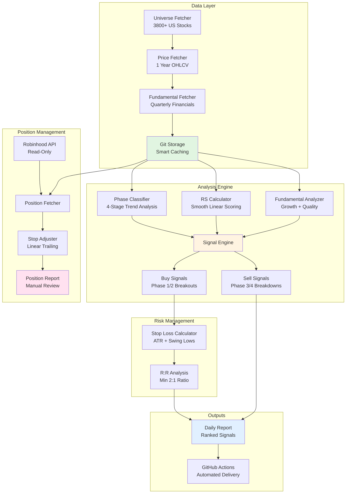

# Intelligent Stock Screener + Long-Term Compounder System

> **A dual-purpose systematic framework for identifying high-probability setups (short-term momentum) and elite 5-10 year compounders (long-term capital compounding).**

[](https://www.python.org/)
[](LICENSE)
[](https://github.com/psf/black)

---

## Table of Contents

- [Overview](#overview)
- [Dual-System Architecture](#dual-system-architecture)
- [Quick Start](#quick-start)
- [System 1: Short-Term Momentum](#system-1-short-term-momentum)
- [System 2: Long-Term Compounding](#system-2-long-term-compounding)
- [Project Structure](#project-structure)
- [Setup & Configuration](#setup--configuration)
- [Daily & Quarterly Workflows](#daily--quarterly-workflows)
- [Technical Details](#technical-details)
- [Contributing](#contributing)
- [License](#license)

---

## Overview

**Intelligent Stock Screener + Long-Term Compounder System** is a production-grade, dual-purpose framework that combines:

**System 1: Short-Term Momentum (Daily)**
- Phase-based trend classification (4-stage market cycle analysis)
- Relative strength momentum scoring vs SPY
- Technical pattern recognition (Minervini Trend Template)
- Risk-managed stop loss recommendations

**System 2: Long-Term Compounding (Quarterly)**
- Fundamental dominance scoring (60/25/15 formula)
- Multi-year relative strength persistence
- Business quality assessment with moat scoring
- Thematic ETF identification and allocation
- Concentration rules with portfolio optimization

Both systems eliminate emotional decision-making with objective, repeatable signals backed by rigorous technical and fundamental analysis.

### What This System Does

**Short-Term System (Daily):**
1. Screens 3,800+ stocks every market day via GitHub Actions
2. Identifies buy signals in Phase 2 uptrends (Minervini's 8-criteria)
3. Identifies sell signals when stocks enter Phase 3/4
4. Calculates precise stop losses (max 10% risk, min 2:1 R:R)
5. Generates daily reports with ranked opportunities
6. Manages positions with trailing stop recommendations

**Long-Term System (Quarterly):**
1. Scores top 500 stocks with compounder engine (60/25/15)
2. Identifies 25 elite 5-10 year wealth builders
3. Scores thematic ETFs (AI, Defense, Energy, Healthcare, Cyber)
4. Builds optimal portfolio with concentration rules
5. Generates quarterly ownership reports with thesis
6. Tracks invalidation triggers for systematic exit rules

### Why I Built It This Way

**Problem:** Most stock screeners rely on static fundamental metrics (P/E, P/B) or generic technical patterns that don't adapt to market conditions. They ignore:
- **Market regime** (is SPY in an uptrend or downtrend?)
- **Relative strength** (is the stock outperforming the market?)
- **Phase transitions** (is the stock breaking out or breaking down?)
- **Smart caching** (redundant API calls wasting time and hitting rate limits)

**Solution:** This system implements Mark Minervini's **Trend Template methodology** where:
- Only buy **confirmed Phase 2 uptrends** (not early Phase 1 bases)
- Must pass **7 of 8 strict technical criteria** (50>150>200 SMA, price near highs, etc.)
- **Timing matters** - only buy when market (SPY) is also healthy
- **Relative strength matters** - only buy stocks outperforming the market
- **Cache-first design** - 74% reduction in API calls through Git-based fundamental storage

---

## Dual-System Architecture

Both systems coexist independently with shared data infrastructure:

```
stock-screener-long-hold/
├── src/
│   ├── screening/               # SHORT-TERM MOMENTUM (Daily)
│   │   ├── momentum_engine.py   # Phase-based scoring
│   │   ├── vcp_detector.py      # Pattern recognition
│   │   └── entry_signals.py     # Buy/sell logic
│   │
│   └── long_term/               # LONG-TERM COMPOUNDING (Quarterly)
│       ├── compounder_engine.py # 60/25/15 scoring
│       ├── regime_classifier.py # 3-regime model
│       ├── moat_scoring.py      # Business quality
│       ├── etf_engine.py        # ETF scoring
│       ├── portfolio_constructor.py  # Allocation
│       └── report_generator.py  # Reports
│
├── data/
│   ├── fundamentals/            # Cached fundamentals (shared)
│   ├── quarterly_reports/       # Long-term outputs
│   └── daily_reports/           # Short-term outputs
│
└── .github/workflows/
    ├── daily_scan.yml           # Runs every market day
    └── quarterly_compounder_scan.yml  # Runs quarterly
```

**Key Design:**
- **Separate scoring engines** - Different philosophies, time horizons
- **Shared data layer** - Cached fundamentals, price data, caching strategy
- **Independent automation** - Daily and quarterly runs don't interfere
- **Dual-purpose assets** - Can hold stocks from both systems simultaneously
- **Complementary insights** - Short-term entries from long-term high-quality base

---

## Quick Start

### For Short-Term Momentum Trading

```bash
# Install dependencies
pip install -r requirements.txt

# Run daily scan (local testing)
python -m src.screening.daily_scan

# Or trigger via GitHub Actions (automatic at market open)
# Results appear in data/daily_reports/
```

### For Long-Term Compounding

```bash
# Run quarterly scan (local testing)
python run_quarterly_compounder_scan.py --test-mode

# Or trigger via GitHub Actions (automatic Jan/Apr/Jul/Oct 15)
# Results appear in data/quarterly_reports/

# View latest quarterly allocation
cat data/quarterly_reports/allocation_model_YYYY_Q*.csv
```

---

## System 1: Short-Term Momentum

The original short-term momentum system identifies high-probability entry points based on the Minervini Trend Template:

- **Time Horizon:** Days to weeks (typical 2-8 week holding periods)
- **Screening Frequency:** Daily
- **Universe:** 3,800+ US stocks
- **Entry Criteria:** 7 of 8 Minervini conditions + relative strength
- **Position Sizing:** Risk-managed with 10% max loss per trade
- **Exit Rules:** Phase transitions or stop loss breach

[See full documentation →](SCREENING_METHODOLOGY.md)

---

## System 2: Long-Term Compounding

The new long-term system identifies elite 5-10 year compounders for wealth building:

- **Time Horizon:** 5-10 years (long-term holdings)
- **Screening Frequency:** Quarterly (Jan 15, Apr 15, Jul 15, Oct 15)
- **Universe:** Top 500 by market cap → Top 25 stocks + 10 ETFs
- **Scoring Formula:** 60% Fundamentals + 25% RS Persistence + 15% Trend
- **Portfolio Optimization:** Concentration rules (10% max/stock, 30% max/sector)
- **Exit Rules:** Thesis invalidation triggers tracked per position

**Key Components:**
- **Fundamental Dominance (60 pts):** Growth quality, capital efficiency, reinvestment, balance sheet
- **RS Persistence (25 pts):** 1Y/3Y/5Y outperformance vs SPY
- **Trend Durability (15 pts):** 40-week MA positioning, slope, consistency
- **Moat Bonus (0-10 pts):** Pricing power, customer lock-in, platform effects
- **Regime Classification:** Structural Growth ✅ / Mature Hold ⏸️ / Capital Destruction ❌

[See full documentation →](PHASE_6_AUTOMATION.md)

---

## Methodology & Attribution

This system implements **Mark Minervini's Trend Template** (also known as SEPA - Specific Entry Point Analysis), a systematic approach to identifying high-probability stock setups in confirmed Stage 2 uptrends.

### Mark Minervini's Influence

The core buy signal methodology is based on principles from:

- **"Trade Like a Stock Market Wizard"** (2013) - Minervini's systematic approach to stock selection using the Trend Template
- **"Think & Trade Like a Champion"** (2017) - Advanced stage analysis and risk management techniques
- **"Momentum Masters"** (2015) - Multi-contributor insights on momentum trading strategies

### The Minervini Trend Template (8 Criteria)

Buy signals **only** trigger when stocks pass **7 of 8 strict criteria**:

1. ✅ **Price > 150 SMA AND 200 SMA** - Stock must be in established uptrend
2. ✅ **150 SMA > 200 SMA** - Moving averages in bullish alignment
3. ✅ **200 SMA trending up ≥1 month** - Long-term trend is bullish
4. ✅ **50 SMA > 150 SMA > 200 SMA** - Strongest SMA configuration (cascading)
5. ✅ **Price > 50 SMA** - Stock respecting short-term support
6. ✅ **Price ≥30% above 52-week low** - Stock has built significant base
7. ✅ **Price within 25% of 52-week high** - Near new highs (not extended)
8. ✅ **Relative Strength ≥70** - Outperforming market (we use RS slope ≥ +0.15)

**Why This Works:**
- Identifies stocks in **confirmed uptrends** (not early bases)
- Filters out weak stocks with poor price structure
- Ensures proper risk/reward (stocks near highs with strong momentum)
- Aligns with institutional buying (big money follows strong trends)

### Additional Influences

While the core entry criteria follow Minervini's template, this system also incorporates concepts from:

- **Stan Weinstein** - 4-stage market cycle analysis ("Secrets for Profiting in Bull and Bear Markets")
- **William O'Neil** - Fundamental screening criteria (CANSLIM methodology)
- **IBD Methodology** - Relative strength ranking and market regime awareness

### Our Implementation

We've automated Minervini's manual screening process with additional enhancements:

- **Smooth linear scoring** instead of binary pass/fail (reduces false signals)
- **Market regime filtering** (SPY phase + breadth checks - only buy in healthy markets)
- **Automated fundamental screening** (growth, profitability, financial health)
- **Precise stop-loss calculation** (ATR-based + swing lows, max 10% risk)
- **R:R validation** (only include signals with ≥2:1 reward/risk ratio)

The system stays true to Minervini's core principle: **Buy confirmed Stage 2 breakouts with strong fundamentals and clear risk management.**

---

## System Architecture



### Data Flow

1. **Daily Scan** (GitHub Actions, 1 PM UTC M-F):
   - Fetches universe of 3,800+ US stocks from NASDAQ/NYSE
   - Downloads 1 year price history for each (250 trading days)
   - Fetches fundamentals using earnings-aware cache refresh strategy
   - Stores in Git-based cache (persists beyond Actions cache limits)

2. **Signal Generation**:
   - Classifies SPY phase to determine market regime
   - Calculates market breadth (% stocks in each phase)
   - For each stock: classifies phase, calculates RS, analyzes fundamentals
   - Scores buy/sell signals using weighted formula
   - Ranks results and generates formatted report

3. **Position Management** (Manual):
   - Fetches current positions from Robinhood (read-only)
   - Loads cached price/fundamental data (zero extra API calls)
   - Analyzes each position's phase, SMA levels, momentum
   - Recommends stop loss adjustments using linear scaling formulas
   - Outputs actionable report with exact price targets

---

## Key Features

### ✅ **Phase-Based Trend Classification**

Stocks are classified into 4 phases based on moving average slopes and price position:

- **Phase 1 (Base Building)**: Consolidation after decline. 50/200 SMA flattening, price finding support. **NOT YET READY**
- **Phase 2 (Uptrend)**: Confirmed uptrend. 50>150>200 SMA (all rising), price above all SMAs. **BUY ZONE** ⭐
- **Phase 3 (Distribution)**: Topping pattern. SMAs starting to flatten/cross, momentum weakening. **SELL ZONE**
- **Phase 4 (Downtrend)**: Declining trend. 50 SMA < 200 SMA, both falling, price below both. **AVOID**

**Important**: Following Minervini's methodology, buy signals **only** trigger for **Phase 2 stocks** that pass the Trend Template. Phase 1 stocks are still basing and not ready for entry.

### 📈 **Relative Strength Momentum**

- Smooth linear scoring (0-10 scale) vs SPY benchmark
- 63-day RS slope calculation (captures 3-month momentum trend)
- Penalizes underperformance, rewards outperformance
- Crucial filter: only buy stocks beating the market

### 💰 **Fundamental Quality Screening**

- **Growth**: Revenue growth, EPS growth trends
- **Profitability**: Operating margins, ROE
- **Financial Health**: Debt ratios, current ratio
- Only applied to Phase 1/2 stocks (Phase 3/4 skip fundamentals - price action is king)

### 🎯 **Risk-Managed Stop Losses**

Every buy signal includes:
- **Entry price**: Current market price or breakout level
- **Stop loss**: ATR-based or swing low-based
- **Risk amount**: $ per share risked
- **Reward target**: 2-3x risk minimum
- **R:R ratio**: Always ≥ 2:1 for inclusion

### 🔄 **Smart Caching Strategy**

- **Price data**: Always fetch fresh (needed for current signals)
- **Fundamentals**: Git-based storage with earnings-aware refresh
  - Earnings season (6-week windows): Refresh if >7 days old
  - Normal periods: Refresh if >90 days old
  - Result: **74% reduction in API calls**, zero GitHub Actions cache expiry issues

### 🤖 **Full Automation**

- Runs daily via GitHub Actions (1 PM UTC, weekdays only)
- No manual intervention required
- Results committed to repository (full history)
- Adaptable to market conditions (skips buy signals in weak markets)

---

## Design Philosophy

### 1. **Cache-First, API-Second**

**Rationale:** yfinance has strict rate limits (~2 req/sec). Scanning 3,800 stocks requires 3,800+ API calls. At 1 TPS, that's 63 minutes. But fundamentals change slowly (quarterly earnings), so why re-fetch every day?

**Solution:**
- Store fundamentals in Git repository as JSON files
- Add metadata with `fetched_at` timestamp
- During scan: Check if cache exists and is fresh
- Only fetch if stale or missing
- Result: 1,762 cached stocks = **74% fewer API calls** = **15-20 min faster scans**

### 2. **Confirmed Uptrends Only (Minervini's Stage 2)**

**Rationale:** Traditional screeners look for "cheap" stocks (low P/E) or early bases (Phase 1). But cheap stocks can get cheaper, and bases can fail. Minervini only buys **confirmed Stage 2 uptrends**.

**Solution:**
- Classify stocks into 4 phases based on SMA slopes and price position
- **Only buy Phase 2** (confirmed uptrends with 50>150>200 SMA alignment)
- Reject Phase 1 (still basing, not confirmed)
- Only sell Phase 2 → 3/4 transitions (breakdowns from tops)
- This filters out 70%+ of stocks immediately, leaving only the highest-quality setups

### 3. **Relative Strength as Primary Filter**

**Rationale:** Absolute returns don't matter - **relative returns** do. A stock up 5% when SPY is up 10% is actually underperforming. Market leaders (high RS) tend to continue leading.

**Solution:**
- Calculate 63-day RS slope (3-month trend)
- Smooth linear scoring (not bucket-based)
- 10 points max for RS in buy signal scoring
- Filters out weak stocks even if other metrics look good

### 4. **Linear Formulas Over Buckets**

**Rationale:** Bucket-based scoring (e.g., "P/E < 15 = 10 points, P/E 15-20 = 5 points") creates artificial cliffs. A stock with P/E 14.9 and P/E 15.1 shouldn't have a 5-point difference.

**Solution:**
- All scoring uses **linear interpolation**
- Example: RS slope scoring scales smoothly from -0.3 (0 points) to +0.3 (10 points)
- Stop loss trailing scales linearly with gain % (5% gain → lock 1% profit, 40% gain → lock 18% profit)
- Result: Smoother, more reasonable scoring

### 5. **Market Regime Awareness**

**Rationale:** Buy signals in a bear market (SPY in Phase 4) have low win rates. Why generate signals that are likely to fail?

**Solution:**
- Classify SPY phase before generating signals
- Calculate market breadth (% stocks in Phase 2)
- Only generate buy signals if:
  - SPY in Phase 1 or 2 (market not declining)
  - AND ≥15% of stocks in Phase 2 (sufficient breadth)
- Sell signals always generated (can exit in any market)

### 6. **Read-Only Position Management**

**Rationale:** Executing trades programmatically is risky and requires extensive safeguards. But **analyzing positions** and **recommending adjustments** can be automated safely.

**Solution:**
- Robinhood integration is **read-only** (only fetches positions)
- Never calls trading functions (no `order_buy_*`, `order_sell_*`)
- Position manager recommends stop adjustments
- Human executes trades manually on Robinhood app
- Best of both worlds: automation + human oversight

---

## Quick Start

### Prerequisites

- Python 3.13+
- GitHub account (for automation)
- Robinhood account (optional, for position management)

### Installation

```bash
# Clone repository
git clone https://github.com/yourusername/stock-screener.git
cd stock-screener

# Create virtual environment
python -m venv venv
source venv/bin/activate  # On Windows: venv\Scripts\activate

# Install dependencies
pip install -r requirements.txt

# (Optional) Install robin-stocks for position management
pip install robin-stocks
```

### Configuration

```bash
# Copy environment template
cp .env.example .env

# Edit .env (only needed for manual position management)
# Add: ROBINHOOD_USERNAME=your_email@example.com
```

### Run Your First Scan

```bash
# Test mode: Scan 100 stocks to verify setup
python run_optimized_scan.py --test-mode

# Full scan: All 3,800+ stocks (30-40 minutes)
python run_optimized_scan.py --conservative
```

### View Results

```bash
# Latest scan results
cat data/daily_scans/latest_optimized_scan.txt

# All historical scans
ls -l data/daily_scans/
```

---

## Daily Workflow

### Automated Mode (GitHub Actions)

The system runs automatically every weekday at 1 PM UTC (9 AM EST):

1. **Scan triggers** via GitHub Actions schedule
2. **Fetches universe** of 3,800+ US stocks
3. **Downloads price data** for all stocks
4. **Loads cached fundamentals** (or fetches if stale)
5. **Classifies phases** and calculates RS
6. **Generates signals** based on market regime
7. **Saves report** to `data/daily_scans/latest_optimized_scan.txt`
8. **Commits results** to repository

**You receive:**
- Daily email/Slack notification (if configured)
- Ranked buy signals with stop losses
- Ranked sell signals with breakdown levels
- Market regime analysis (SPY phase + breadth)

### Manual Mode (Local)

Run on-demand scans:

```bash
# Conservative scan (2 workers, 1.0s delay = ~2 TPS)
python run_optimized_scan.py --conservative

# Default scan (3 workers, 0.5s delay = ~6 TPS)
python run_optimized_scan.py

# Aggressive scan (5 workers, 0.3s delay = ~17 TPS) - MAY HIT RATE LIMITS
python run_optimized_scan.py --aggressive

# Resume from interruption
python run_optimized_scan.py --resume

# Clear cached progress and start fresh
python run_optimized_scan.py --clear-progress
```

---

## Manual Position Management

**⚠️ Note:** Position management requires manual execution. This is intentional for safety.

### Step 1: Ensure Robinhood Username is Set

In your `.env` file:

```bash
ROBINHOOD_USERNAME=your_email@example.com
```

**Important:** Password is NEVER stored. You will be prompted interactively.

### Step 2: Run Position Manager

```bash
# Basic analysis (prompts for password + SMS MFA)
python manage_positions.py

# With entry dates for tax-aware recommendations
python manage_positions.py --entry-dates entry_dates.json

# Export report to file
python manage_positions.py --export
```

### Step 3: Interactive Authentication

```
Logging in to Robinhood...
Robinhood password for ryanhamby22@gmail.com: ********

MFA required - check your phone for SMS code from Robinhood
Enter SMS code from Robinhood: 123456

✓ Robinhood login successful with SMS MFA
```

### Step 4: Review Recommendations

The tool will:
- Fetch your current positions from Robinhood
- Analyze each using **cached market data** (zero extra API calls)
- Calculate phase, SMA levels, recent swing lows
- Recommend stop loss adjustments using linear formulas

### Example Output

```
================================================================================
POSITION MANAGEMENT REPORT - STOP LOSS RECOMMENDATIONS
Generated: 2025-12-06 10:30:15
================================================================================

PORTFOLIO SUMMARY
--------------------------------------------------------------------------------
Total Positions: 3
Need Stop Adjustment: 2
Short-term (<1 year): 2
Long-term (1+ years): 1
Average Gain: +8.47%

⚠️  URGENT ACTIONS NEEDED
--------------------------------------------------------------------------------

NVDA (+10.10%)
  • Big winner - consider taking partial profits

================================================================================

################################################################################
POSITION #1: AAPL
################################################################################
Entry: $175.50 | Current: $182.30 | Gain: +3.87%
Tax Treatment: SHORT_TERM
Days Held: 45

ACTION: HOLD

RATIONALE:
Position up 3.9% - hold initial stop. Wait for 5-10% gain before adjusting.

Technical: Phase 2 | 50 SMA: $178.20

################################################################################

POSITION #2: NVDA
################################################################################
Entry: $495.00 | Current: $545.00 | Gain: +10.10%
Tax Treatment: SHORT_TERM
Days Held: 20

ACTION: TRAIL TO PROFIT

✓ RECOMMENDED STOP LOSS: $519.75

RATIONALE:
Position up 10.1% - TRAIL TO PROFIT

  NEW STOP LOSS: $519.75
    • Locks in minimum +5.0% profit
    • Stop type: profit-based

  Technical: Phase 2 | 50 SMA: $512.30

################################################################################

POSITION #3: MSFT
################################################################################
Entry: $380.00 | Current: $385.50 | Gain: +1.45%
Tax Treatment: LONG_TERM
Days Held: 400

ACTION: HOLD

RATIONALE:
LONG-TERM HOLD (400 days) - Preserve long-term capital gains tax rate.
No stop adjustment recommended.

================================================================================
```

### Stop Loss Logic

Recommendations use **linear formulas** (not buckets):

| Gain Range | Recommendation | Stop Level |
|------------|----------------|------------|
| 0-5% | Hold initial stop | Original stop |
| 5-10% | Trail to breakeven | Entry price |
| 10-20% | Trail to profit | Entry × (1 + locked_profit_pct/100) |
| 20-30% | Take 25-30% partial | Remaining at +10% profit |
| 30%+ | Take 50% partial | Remaining at tight trail |

**Locked profit % formula:**
```python
locked_profit_pct = min(gain_pct - 3, gain_pct * 0.5)
```

Examples:
- 5% gain → Lock 2% profit
- 10% gain → Lock 3.5% profit
- 20% gain → Lock 8.5% profit
- 40% gain → Lock 18.5% profit

### Tax-Aware Filtering

**Long-term positions (365+ days held)** are excluded from stop adjustments to preserve favorable capital gains tax treatment (15-20% vs ordinary income rate).

To enable:

1. Create `entry_dates.json`:
```json
{
  "AAPL": "2024-10-18T00:00:00",
  "NVDA": "2024-11-13T00:00:00",
  "MSFT": "2023-05-10T00:00:00"
}
```

2. Run with `--entry-dates`:
```bash
python manage_positions.py --entry-dates entry_dates.json
```

---

## Project Structure

```
stock-screener/
├── .github/
│   └── workflows/
│       └── daily_scan.yml              # GitHub Actions automation
│
├── src/
│   ├── data/
│   │   ├── fetcher.py                  # YahooFinanceFetcher (price data)
│   │   ├── fundamentals_fetcher.py     # Quarterly financials fetcher
│   │   ├── git_storage_fetcher.py      # Smart cache (74% API reduction)
│   │   ├── enhanced_fundamentals.py    # FMP integration (optional)
│   │   ├── universe_fetcher.py         # NASDAQ/NYSE stock universe
│   │   └── robinhood_positions.py      # Robinhood read-only API
│   │
│   ├── screening/
│   │   ├── phase_indicators.py         # 4-phase classification
│   │   ├── signal_engine.py            # Buy/sell signal scoring
│   │   ├── benchmark.py                # SPY analysis + market breadth
│   │   └── optimized_batch_processor.py # Parallel processing engine
│   │
│   └── analysis/
│       └── position_manager.py         # Stop loss recommendations
│
├── data/
│   ├── fundamentals_cache/             # Git-tracked fundamentals (1762 stocks)
│   ├── daily_scans/                    # Historical scan reports
│   └── position_reports/               # Position management reports
│
├── run_optimized_scan.py               # Main scanner CLI
├── manage_positions.py                 # Position management CLI
├── automated_position_report.py        # GitHub Actions position report
│
├── README.md                           # This file
├── requirements.txt                    # Python dependencies
└── .env                                # Local configuration (gitignored)
```

---

## Technical Details

### Phase Classification Algorithm

```python
def classify_phase(price_data: pd.DataFrame, current_price: float) -> Dict:
    """
    Classifies stock into 4 phases based on SMA slopes and price position.

    Returns:
        {
            'phase': int (1-4),
            'phase_name': str,
            'confidence': float (0-100),
            'sma_50': float,
            'sma_200': float,
            'slope_50': float (annualized),
            'slope_200': float (annualized),
            'reasons': List[str]
        }
    """
```

**Logic:**
1. Calculate 50-day and 200-day SMAs
2. Calculate slopes (annualized % change rate)
3. Classify phase based on:
   - SMA ordering (50 > 200 or 50 < 200)
   - Slope directions (rising, falling, or flat)
   - Price position relative to SMAs
4. Return phase with confidence score

### Relative Strength Calculation

```python
def calculate_relative_strength(
    stock_prices: pd.Series,
    spy_prices: pd.Series,
    period: int = 63
) -> pd.Series:
    """
    Calculates smooth RS using linear regression slope.

    Args:
        stock_prices: Stock close prices
        spy_prices: SPY close prices (benchmark)
        period: Lookback window (63 days = 3 months)

    Returns:
        Series of RS slopes (annualized)
    """
```

**Formula:**
```
RS_ratio = stock_return / spy_return
RS_slope = linear_regression_slope(RS_ratio, period)
RS_score = clip((RS_slope + 0.3) / 0.6 * 10, 0, 10)
```

Interpretation:
- RS slope +0.3 = 10 points (strong outperformance)
- RS slope 0.0 = 5 points (matching market)
- RS slope -0.3 = 0 points (strong underperformance)

### Buy Signal Scoring (110 points max)

| Component | Max Points | Criteria |
|-----------|------------|----------|
| **Phase** | 30 | Phase 2 = 30, Phase 1 = 20 |
| **RS Momentum** | 10 | Linear scale from RS slope |
| **Volume** | 10 | Breakout on high volume |
| **Proximity to Breakout** | 10 | Close to resistance level |
| **Fundamentals** | 50 | Growth (20) + Profitability (15) + Health (15) |

**Threshold:** Buy signal score ≥ 70 for inclusion in report.

### Sell Signal Scoring (110 points max)

| Component | Max Points | Criteria |
|-----------|------------|----------|
| **Phase** | 30 | Phase 4 = 30, Phase 3 = 20 |
| **RS Momentum** | 10 | Negative RS (underperformance) |
| **Volume** | 10 | Breakdown on high volume |
| **SMA Breakdown** | 15 | Broke below 50/200 SMA |
| **Price Action** | 15 | Lower highs, lower lows |
| **Severity** | 30 | Combination of above factors |

**Threshold:** Sell signal score ≥ 60 for inclusion in report.

### Stop Loss Calculation

```python
def calculate_stop_loss(
    entry_price: float,
    price_data: pd.DataFrame,
    atr_period: int = 14,
    atr_multiplier: float = 2.0
) -> Dict:
    """
    Calculates stop loss using ATR or swing lows.

    Returns:
        {
            'stop_price': float,
            'risk_amount': float,
            'stop_type': str ('atr' or 'swing_low')
        }
    """
```

**Method 1: ATR-Based**
```
ATR = Average True Range (14 days)
Stop = Entry - (ATR × 2.0)
```

**Method 2: Swing Low-Based**
```
Swing_Low = Lowest low in last 20 days
Stop = Swing_Low × 0.98  (2% buffer)
```

Uses whichever is **higher** (more conservative).

### Risk/Reward Validation

Every buy signal calculates:
```python
risk = entry_price - stop_loss
reward = (entry_price × 1.20) - entry_price  # 20% target
r_r_ratio = reward / risk
```

**Filter:** Only include signals with R:R ≥ 2:1.

---

## Future Improvements

### Short-Term (Next 3 Months)

- [ ] **Backtesting Engine**
  - Simulate historical trades using phase transitions
  - Calculate win rate, profit factor, max drawdown
  - Optimize signal thresholds based on historical performance
  - Compare against buy-and-hold SPY baseline

- [ ] **Enhanced Reporting**
  - Add charts to daily report (SPY trend, market breadth, top signals)
  - Email delivery with HTML formatting
  - Slack integration with interactive buttons
  - Web dashboard for historical tracking

- [ ] **Smart Alerts**
  - Real-time alerts when positions hit stop levels
  - Notify when new high-score buy signals appear
  - Alert on market regime changes (SPY phase transitions)

### Medium-Term (3-6 Months)

- [ ] **Multi-Timeframe Analysis**
  - Add weekly phase classification (longer-term trend)
  - Combine daily + weekly phases for higher-conviction signals
  - Filter out counter-trend trades (daily bullish, weekly bearish)

- [ ] **Sector Rotation**
  - Track which sectors are leading/lagging
  - Adjust signal thresholds based on sector strength
  - Identify sector rotation opportunities

- [ ] **Options Integration**
  - Fetch option chain data for buy signals
  - Recommend covered call strikes for profitable positions
  - Identify protective put opportunities for Phase 3 stocks

- [ ] **Paper Trading**
  - Simulate trades in paper account
  - Track P&L of generated signals
  - Validate system performance before real capital

### Long-Term (6-12 Months)

- [ ] **Machine Learning Enhancement**
  - Train ML model on historical phase transitions
  - Predict probability of Phase 1 → 2 breakout success
  - Improve signal ranking using learned features

- [ ] **Alternative Data Sources**
  - Integrate insider trading data (SEC Form 4)
  - Add institutional ownership changes (13F filings)
  - Sentiment analysis from news/social media

- [ ] **Portfolio Construction**
  - Optimal position sizing based on volatility
  - Correlation-based diversification
  - Risk parity allocation across sectors

- [ ] **Execution Optimization**
  - Optimal entry timing (limit orders vs market orders)
  - Partial entry strategies (scale in over multiple days)
  - Bracket orders (auto-set stops and targets)

### Infrastructure

- [ ] **Database Migration**
  - Move from file-based cache to PostgreSQL
  - Enable complex queries (sector rotation, correlation analysis)
  - Faster lookups for backtesting

- [ ] **Real-Time Data**
  - Integrate with real-time data provider (IEX Cloud, Polygon)
  - Intraday phase classification (15-min bars)
  - Live stop loss monitoring

- [ ] **Web UI**
  - Interactive dashboard for browsing signals
  - Position tracker with live P&L
  - Backtest explorer with equity curves

---

## Contributing

This project is currently a personal trading system. If you'd like to contribute:

1. Fork the repository
2. Create a feature branch (`git checkout -b feature/amazing-feature`)
3. Make your changes with tests
4. Commit (`git commit -m 'Add amazing feature'`)
5. Push (`git push origin feature/amazing-feature`)
6. Open a Pull Request

**Code Standards:**
- Python 3.13+
- Type hints required
- Docstrings for all public functions
- Black code formatting
- pytest for tests (>80% coverage)

---

## License

MIT License - See [LICENSE](LICENSE) file for details.

---

## Disclaimer

**This system is for educational and informational purposes only.**

- Not financial advice
- Past performance does not guarantee future results
- Trading stocks involves risk of loss
- Always do your own research
- Never invest more than you can afford to lose
- Consult a licensed financial advisor before making investment decisions

The author is not responsible for any financial losses incurred using this system.

---

## Contact

**Ryan Hamby**
Email: ryanhamby22@gmail.com
LinkedIn: [linkedin.com/in/ryanhamby](https://linkedin.com/in/ryanhamby)

For Robinhood employees reviewing this project: I'm happy to discuss the technical architecture, design decisions, and potential applications for institutional trading systems. Feel free to reach out!

---

*Built with Python, powered by data, driven by discipline.*
